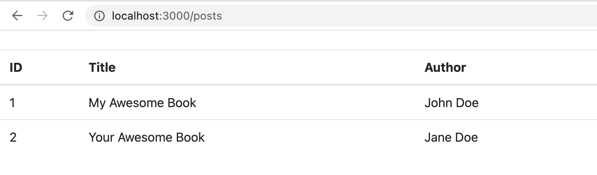

# ExpressJS Code Generator with OPEN AI ChatGPT

Prototype code generator base on OPEN AI using expressJS

## Installation

Clone this repo and run `yarn install`

## Configuration

Register API Open AI & create API KEY in https://platform.openai.com/account/api-keys

create file `.env` in root project, and add Your API KEY

```
OPENAI_API_KEY=YOUR_API_KEY
```

## Coding Your App

Update configs.json

```
{
    "route-api": {
        "/posts": {
            "content": "create json array contain field id, title, author"
        }
    },
    "route-web": {
        "/posts": {
            "content": "using javascript, create fetch function to get data posts from api http://localhost:3000/posts, and then display in html table form with column id, title and author and use bootstrap css framework",
            "filename": "views/posts.ejs"
        }
    }
}
```

## Generate Code

```
yarn generate
```

## Run App

```
yarn start
```

## Sample



Happy Coding